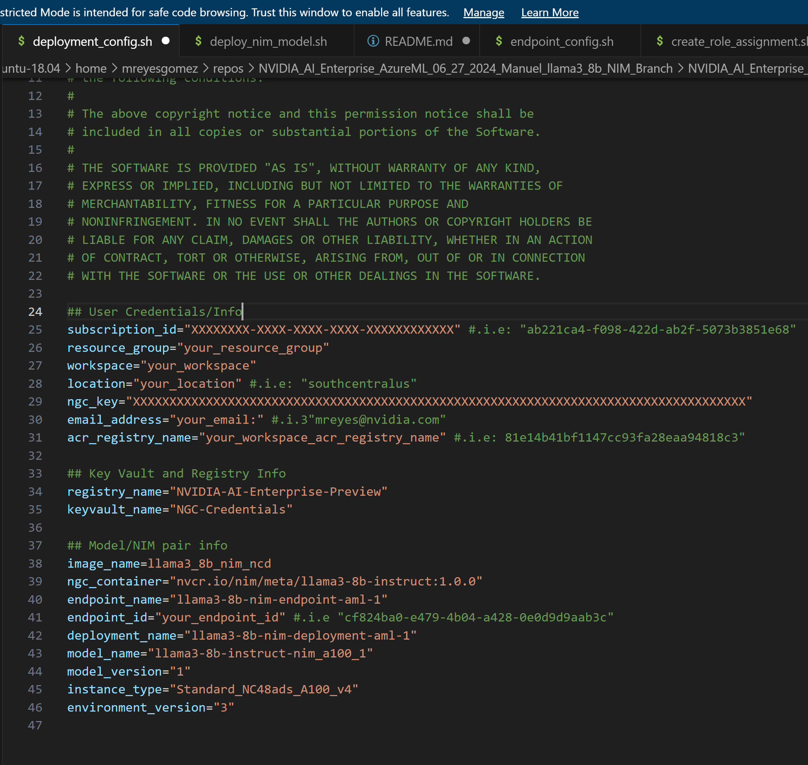
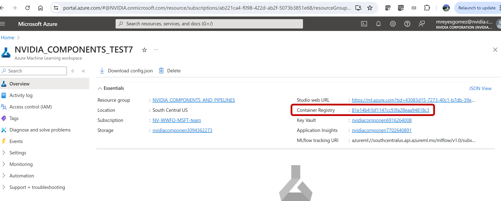

# llama3_8b model and NIM container deployment

Folder scripts contains the code to deploy the llama3_8b model and NIM container as an Azure AI Studio Inference Endpoint
The scripts use Azure CLI to perform the deployment

The scripts are quite generic and could be used to deploy any Model/NIM container pair with minimum changes

## Config File
Specific details with respect to the Azure user credentials and about the Model/NIM pair being deployed are specified on config file: scripts\config_file\deployment_config.sh

**User would need to edit all the ## User Credentials/Info entries**

The value of the acr_registry_name entry is the default container registry corresponding to the Workspace being used 

### NGC Key
The value of the ngc_key entry should be the one obtained by following [procedure](https://docs.nvidia.com/ngc/gpu-cloud/ngc-user-guide/index.html#generating-api-key)

The NGC Key is needed because the NIM Container is going to download the required model directky from NGC and the key is necessary to identify the user

In this code we experimented passing the NGC Key to the deployment yml file using two methods

* By directly placing the NGC Key from the config file into the deployment yml file
* By first creating a Key Vault, passing the NGC Key from the config file as a secret to the vault and then passing the Key Vault secret value into the deployment yml file.
This method is currently failing

## Main script deploy_nim_model.sh
This script is the main driver of all the functionality

### Push the given NIM to the workspace Azure Container Registry

Running the main script with the following parameter

<pre style="background-color:rgba(0, 0, 0, 0.0470588)">bash scripts/deploy_nim_model.sh --push_container_to_acr
</pre>

Will push the given container into the provided workspace container registry

The code would first pull the container from NGC and would prompt the user for its credentials to do so.

NVIDIA AI Enterprise is an end-to-end platform for building accelerated production AI.

It includes a library of full-stack software including NVIDIA AI Workflows, frameworks, pretrained models and infrastructure optimization which streamline the development and deployment of production-ready applications for generative AI, speech AI, vision AI, cybersecurity, and more.
It is comprised of several sdk.

