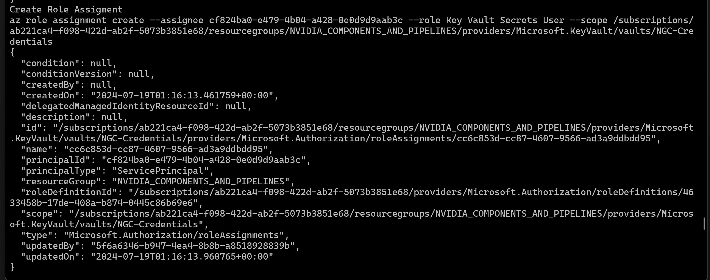

# llama3_8b model and NIM container deployment

Folder scripts contains the code to deploy the llama3_8b model and NIM container as an Azure AI Studio Inference Endpoint
The scripts use Azure CLI to perform the deployment

The scripts are quite generic and could be used to deploy any Model/NIM container pair with minimum changes

## Config File
Specific details with respect to the Azure user credentials and about the Model/NIM pair being deployed are specified on config file: scripts\config_file\deployment_config.sh

**User would need to edit all the ## User Credentials/Info entries**

### acr_registry_name
The value of the acr_registry_name entry is the default container registry corresponding to the Workspace being used 

### NGC Key
The value of the ngc_key entry should be the one obtained by following this [procedure](https://docs.nvidia.com/ngc/gpu-cloud/ngc-user-guide/index.html#generating-api-key)

The NGC Key is needed because the NIM Container is going to download the required model directly from NGC and the key is necessary to identify the user

In this code we experimented passing the NGC Key to the deployment yml file using two methods

* By directly placing the NGC Key from the config file into the deployment yml file
* By first creating a Key Vault, passing the NGC Key from the config file as a secret to the vault and then passing the Key Vault secret value into the deployment yml file.

This method is currently failing

## Main script deploy_nim_model.sh
This script is the main driver of all the functionality

### Push the given NIM to the workspace Azure Container Registry

Running the main script with the following parameter

<pre style="background-color:rgba(0, 0, 0, 0.0470588)">bash scripts/deploy_nim_model.sh --push_container_to_acr
</pre>

Will push the given container into the provided workspace container registry

The code will first pull the container from NGC and will prompt the user for its credentials to do so.

If the run succeed the user should be able to find the provided container under the provided image name on the provided workspace container registry

### Create the endpoint with the provided name
Running the main script with the following parameter

<pre style="background-color:rgba(0, 0, 0, 0.0470588)">bash scripts/deploy_nim_model.sh --create_endpoint
</pre>

Will create an endpoint with the provided name under the provided workspace

Now that the endpoint had been created the user can update the endpoint_id entry on the config file:
scripts\config_file\deployment_config.sh

By clicking on the provided resource group, filtering by Machine LEarning Online Endpoint, locating the endpoint and clicking on its link

And then clicking on the Identity tab, one can find the endpoint id

which should be entered on the config file

### Create the deployment using the ACR Image and explicitly using the NGC Key on the Deployment yml file

Running the main script with the following parameters

<pre style="background-color:rgba(0, 0, 0, 0.0470588)">bash scripts/deploy_nim_model.sh --create_deployment --deployment_type="ACR"
</pre>

Will first replace the placeholders on template yml file:  scripts\auxiliary_file\deployment_acr_aml.yml with the values provided in the config file to generate the following yml file

The deployment should succeed and one should be able to locate it under the provided endpoint

### Create the deployment using the ACR Image, creating a Key Vault to store the NGC Key as a secret and then using on the Deployment yml file

Running the main script with the following parameters

<pre style="background-color:rgba(0, 0, 0, 0.0470588)">bash scripts/deploy_nim_model.sh --create_keyvault --use_keyvault --create_deploy
ment --deployment_type="ACR"
</pre>

The code will first create a Key Vault with the specified name

Then in would create a secret containing the NGC Key provided on the config file:

The code will then give the Key Vault Secrets User role to the Endpoint

From the Azure Portal, one can confirm the Role was succesfully assigned

Then the code will replace the placeholders on template yml file:  scripts\auxiliary_file\deployment_acr_aml.yml with the values provided in the config file to generate the following yml file:

However the deployment fails

